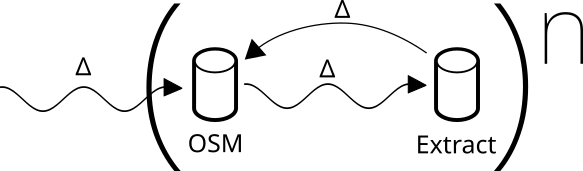

# Clearance
## Monitoring and extracting data from OSM under quality constraints

## SotM EU 2023

Frédéric Rodrigo - Teritorio

frederic@teritorio.fr

---

## Context

Needs
- Expose and provide OSM data
- web site, printed maps
- Quality and liability of content
- eg. defibrillator

Goals
- Contribute to OSM
- Collaborate
- Update local data

---

# Quality

----

### Quality – In first place

Editors validators

- Variables rules
- Optional: validation and rules respect
- Validation Rules depends of Usage

----

### Quality - After contributions

Anomalies detections

- Keep Right
- OSM Inspector
- Osmose-QA

Endless Iterations on quality

---

## Data Update

- Incoming Diff
- Corrections back to OSM

Quality of incoming update is never know

---

## External changes validation

Changes validation of OSM

- OSMCha
- Osm-analytic-tracker

---

## Update filter

----

### Simple Filtering

- [LeBonTag](https://www.lebontag.fr/) (FLOSS)
- Teritorio (not FLOSS)

----

### LoCha

MaRS / Daylight from Meta (Facebook)

- Local changes coherence
- Partial update (local and temporal)

---

## Problems

- MaRS
  - internal closed project
- Daylight
  - unknown validation rules
  - internal agenda
- LeBonTag
  - not open to data collaboration
  - target GIS usage
  - by object validation

---

## Functionals Goals

- Configurable rules
- Avoid human validation: Automatic Filter
- Collaborative
  - on Human validation
  - on Shared interest: Territories, Thematics
- Locals coherence of objects

----

## Technical Goals

- Act as an OSM data proxy
  - I/O format: PBF OSM + diff
- Stream Update, up to minutely diff

---

# Clearance

----

## Clearance Instance

One instance: Many projects

One project, One community:
- Area
- Thematic
- Rules Set
- OSM Extract + Diff

Eg: Tourism, Railway Stations, Hiking…

----

## Clearance Engine

- Database, import
  - OSM Extract
  - Diff, as is, unapplied
- Validation Rules Engine (on LoCha)
  - OK ⇒ Apply LoCha
  - Not OK ⇒ Hold LoCha
    - If Σ changes OK ⇒ apply
    - Else hold LoCha unless manual validation
- Export as OSM Extract + Diff

Invariant: quality is increasing*

----

## Validation Rules

Check on
- metadata
- tags
- geom
- changeset

----

## Validation Rules

Objects changes alone or in groups

- Acceptable
- With Doubt / Without validation Annotation
- Rejected

Check between last accepted object version and holden changes

----

## Rules examples

- Changes
  - move geom > 10m
  - changes by a new contributor
  - tags black list
- Final state validation
  - bakery should have a name
  - bakery should not be duplicated

---

## Clearance Project Advancement: Beta

- ✅ Import / Export + diff
- ✅ Web UI for check and manual validation
- ⌛ Rules Set Validation
- ⌛ Access validated data with Overpass Like API
- 🯀 LoCha Validation

[Beta Demo](https://clearance-dev.teritorio.xyz/landes_tourism_poi/changes_logs/)

---

# Conclusion

Clearance: OSM Extracts under quality conformance

- Prototype in progress
- Ask for new project on the Beta instance
- https://github.com/teritorio/clearance
- https://github.com/teritorio/clearance-frontend
- State of the arts https://medium.com/@frederic.rodrigo/state-of-the-art-openstreetmap-extraction-synchronization-under-quality-constraints-3d46907c5151
